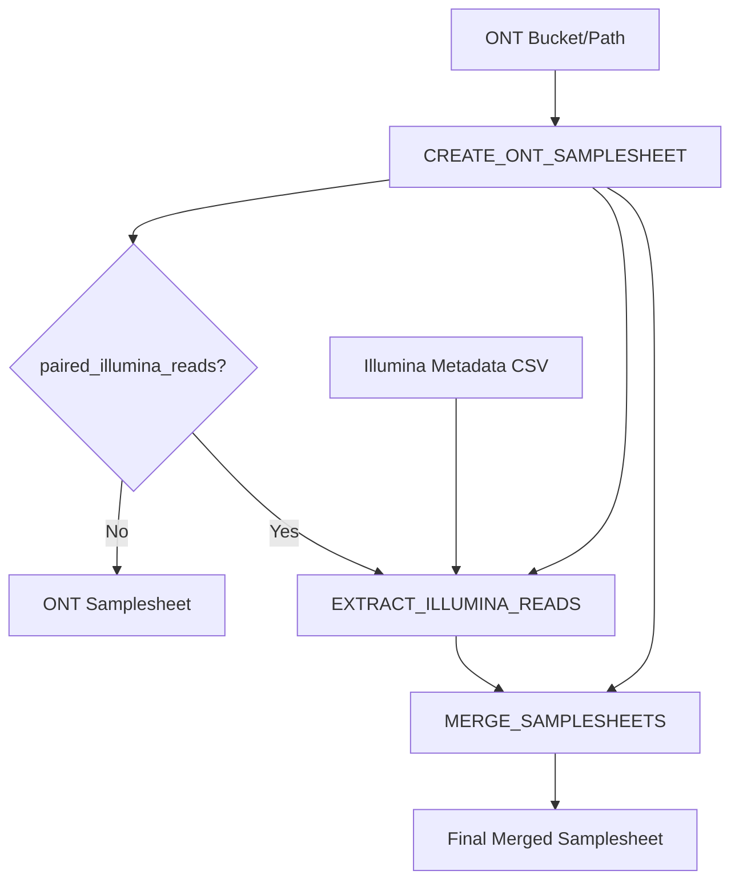

# fastqforge

**FASTQ Organization for Read Grouping and Enumeration - A samplesheet generator for Oxford Nanopore Technologies (ONT) data**

[](https://www.nextflow.io/)
[](https://www.docker.com/)
[](https://sylabs.io/docs/)

## Introduction

**fastqforge** is a bioinformatics pipeline that automatically generates structured samplesheets for Oxford Nanopore Technologies (ONT) sequencing data. The pipeline can operate in two modes:

1. **ONT-only mode**: Generates a samplesheet from ONT FASTQ files stored in S3, Google Cloud Storage, or local filesystems
2. **Hybrid mode**: Matches ONT samples with corresponding paired-end Illumina reads and creates a merged samplesheet for hybrid assembly workflows

The pipeline automates the tedious task of creating samplesheets by:
- Discovering ONT FASTQ files based on run ID patterns
- Extracting sample IDs from standardized filename conventions
- Optionally matching ONT samples with Illumina paired-end reads
- Generating properly formatted CSV samplesheets ready for downstream analysis

### Pipeline Overview



### Pipeline Steps

**ONT-only Mode:**
1. `CREATE_ONT_SAMPLESHEET` - Searches for ONT FASTQ files matching the pattern `*-<runid>.fastq.gz` and generates a samplesheet with `sample,fastq` columns


**Hybrid Mode:**

2. `EXTRACT_ILLUMINA_READS` - Matches ONT samples with Illumina paired-end reads from a metadata CSV

3. `MERGE_SAMPLESHEETS` - Combines ONT and Illumina data into a unified samplesheet with `sample,fastq,fastq_1,fastq_2` columns

## Quick Start

> [!NOTE]
> If you are new to Nextflow and nf-core, please refer to [this page](https://nf-co.re/docs/usage/installation) on how to set-up Nextflow.

### Installation

1. Install [Nextflow](https://www.nextflow.io/docs/latest/getstarted.html#installation) (`>=24.04.2`)
2. Install [Docker](https://docs.docker.com/engine/installation/) or [Singularity](https://www.sylabs.io/guides/3.0/user-guide/) for container support

### Running the Pipeline

#### ONT-only Mode

Generate a samplesheet from ONT FASTQ files:

```bash
nextflow run DOH-HNH0303/fastqforge \
   -profile docker \
   --runid <RUN_ID> \
   --ont_bucket <PATH_TO_ONT_DATA> \
   --outdir results
```

**Example:**
```bash
nextflow run DOH-HNH0303/fastqforge \
   -profile docker \
   --runid 20240115_experiment01 \
   --ont_bucket s3://my-bucket/ont-data \
   --outdir results
```

#### Hybrid Mode (ONT + Illumina)

Generate a merged samplesheet with both ONT and Illumina reads:

```bash
nextflow run DOH-HNH0303/fastqforge \
   -profile docker \
   --runid <RUN_ID> \
   --ont_bucket <PATH_TO_ONT_DATA> \
   --paired_illumina_reads true \
   --fastq_files <ILLUMINA_METADATA_CSV> \
   --outdir results
```

**Example:**
```bash
nextflow run DOH-HNH0303/fastqforge \
   -profile docker \
   --runid 20240115_experiment01 \
   --ont_bucket s3://my-bucket/ont-data \
   --paired_illumina_reads true \
   --fastq_files illumina_metadata.csv \
   --outdir results
```

> [!WARNING]
> Please provide pipeline parameters via the CLI or Nextflow `-params-file` option. Custom config files including those provided by the `-c` Nextflow option can be used to provide any configuration _**except for parameters**_; see [docs](https://nf-co.re/docs/usage/getting_started/configuration#custom-configuration-files).

## Parameters

### Required Parameters

| Parameter | Type | Description |
|-----------|------|-------------|
| `--runid` | string | **Required.** The run identifier used in FASTQ filenames (e.g., `20240115_experiment01`). Files must match pattern `*-<runid>.fastq.gz` |
| `--ont_bucket` | string | **Required.** Path to ONT data. Supports S3 (`s3://`), Google Cloud Storage (`gs://`), or local filesystem paths |
| `--outdir` | string | Output directory for results. Default: `results` |

### Optional Parameters

| Parameter | Type | Description | Default |
|-----------|------|-------------|---------|
| `--paired_illumina_reads` | boolean | Enable hybrid mode to match ONT with Illumina reads | `false` |
| `--fastq_files` | path | Path to Illumina metadata CSV (required if `--paired_illumina_reads` is `true`) | `null` |

### Profile Options

| Profile | Description |
|---------|-------------|
| `docker` | Run using Docker containers (recommended) |
| `singularity` | Run using Singularity containers |
| `conda` | Run using Conda environments |
| `wave` | Use Seqera Wave for on-demand container provisioning |

## Input Specifications

### ONT Data Structure

The pipeline expects ONT FASTQ files to follow this naming convention:
```
<sample_id>-<runid>.fastq.gz
```

**Example file structure:**
```
s3://my-bucket/ont-data/20240115_experiment01/reads/
├── sample001-20240115_experiment01.fastq.gz
├── sample002-20240115_experiment01.fastq.gz
└── sample003-20240115_experiment01.fastq.gz
```

The pipeline will extract `sample001`, `sample002`, `sample003` as sample IDs.

### Illumina Metadata CSV Format

When using `--paired_illumina_reads true`, you must provide a CSV file with the following columns:

| Column | Description |
|--------|-------------|
| `id_alt` | Sample identifier matching ONT sample basename |
| `current` | Full path to Illumina FASTQ file |
| `file` | Filename (used to detect R1/R2) |

**Example `illumina_metadata.csv`:**
```csv
id_alt,current,file
sample001,s3://bucket/illumina/sample001_R1_001.fastq.gz,sample001_R1_001.fastq.gz
sample001,s3://bucket/illumina/sample001_R2_001.fastq.gz,sample001_R2_001.fastq.gz
sample002,s3://bucket/illumina/sample002_R1_001.fastq.gz,sample002_R1_001.fastq.gz
sample002,s3://bucket/illumina/sample002_R2_001.fastq.gz,sample002_R2_001.fastq.gz
```

> [!NOTE]
> The pipeline uses a matching algorithm that extracts the base sample ID by splitting on the first hyphen (`-`) character.

## Output Files

### ONT-only Mode

**File:** `results/ont_samplesheet.csv`

```csv
sample,fastq
sample001-20240115_experiment01,s3://my-bucket/ont-data/20240115_experiment01/reads/sample001-20240115_experiment01.fastq.gz
sample002-20240115_experiment01,s3://my-bucket/ont-data/20240115_experiment01/reads/sample002-20240115_experiment01.fastq.gz
```

### Hybrid Mode

**Files:**
- `results/ont_samplesheet.csv` - ONT data only
- `results/illumina_reads.csv` - Illumina paired reads
- `results/samplesheet.csv` - Merged output (main result)

**Final output:** `results/samplesheet.csv`

```csv
sample,fastq,fastq_1,fastq_2
sample001-20240115_experiment01--sample001,s3://bucket/ont/sample001-20240115_experiment01.fastq.gz,s3://bucket/illumina/sample001_R1_001.fastq.gz,s3://bucket/illumina/sample001_R2_001.fastq.gz
sample002-20240115_experiment01--sample002,s3://bucket/ont/sample002-20240115_experiment01.fastq.gz,s3://bucket/illumina/sample002_R1_001.fastq.gz,s3://bucket/illumina/sample002_R2_001.fastq.gz
```

### Pipeline Reports

The pipeline automatically generates execution reports in `results/pipeline_info/`:
- `execution_timeline_*.html` - Timeline of all process executions
- `execution_report_*.html` - Resource usage and statistics
- `execution_trace_*.txt` - Detailed trace of all tasks
- `pipeline_dag_*.html` - Visual representation of the pipeline DAG

## Use Cases

### 1. Generating ONT Samplesheets for nf-core/nanoseq

```bash
nextflow run DOH-HNH0303/fastqforge \
   -profile docker \
   --runid 20240115_run001 \
   --ont_bucket s3://my-ont-data/run001 \
   --outdir ont_samplesheets
```

Use the output `ont_samplesheets/ont_samplesheet.csv` directly with nf-core/nanoseq.

### 2. Hybrid Assembly Workflows

```bash
nextflow run DOH-HNH0303/fastqforge \
   -profile docker \
   --runid 20240115_run001 \
   --ont_bucket s3://my-ont-data/run001 \
   --paired_illumina_reads true \
   --fastq_files illumina_manifest.csv \
   --outdir s3://hybrid_samplesheets
```


### 3. Local Filesystem Usage

```bash
nextflow run DOH-HNH0303/fastqforge \
   -profile docker \
   --runid 20240115_run001 \
   --ont_bucket /data/ont-sequencing/run001 \
   --outdir results
```

## Troubleshooting

### No FASTQ files found

**Error:** `ERROR: No FASTQ files found matching pattern: *-<runid>.fastq.gz`

**Solutions:**
- Verify the `--runid` parameter matches your filename pattern exactly
- Check that `--ont_bucket` points to the correct directory containing the `reads/` subdirectory
- Ensure FASTQ files follow the naming convention: `<sample>-<runid>.fastq.gz`

### Illumina reads not matching

**Warning:** `WARNING: No matching Illumina reads found for any ONT samples`

**Solutions:**
- Check that the `id_alt` column in your Illumina metadata CSV matches the sample basenames from ONT data
- Verify that R1 and R2 files are properly labeled with `_R1` and `_R2` patterns
- Review the sample ID extraction logic (splits on first hyphen by default)

### AWS S3 authentication

If you encounter S3 access errors:
- Ensure AWS credentials are configured (`aws configure` or environment variables)
- Verify IAM permissions for S3 bucket access
- Check that the S3 path is correct and accessible

### Google Cloud Storage authentication

For GCS paths:
- Ensure `gcloud` CLI is installed and authenticated
- Set up application default credentials: `gcloud auth application-default login`
- Verify bucket permissions

## Advanced Usage

### Using Wave for Container Provisioning

```bash
nextflow run DOH-HNH0303/fastqforge \
   -profile docker,wave \
   --runid 20240115_run001 \
   --ont_bucket s3://my-bucket/data \
   --outdir results
```

### Custom Nextflow Configuration

Create a custom config file `custom.config`:

```groovy
process {
    cpus = 2
    memory = 8.GB
    time = 2.h
}
```

Run with custom configuration:

```bash
nextflow run DOH-HNH0303/fastqforge \
   -profile docker \
   -c custom.config \
   --runid 20240115_run001 \
   --ont_bucket s3://my-bucket/data \
   --outdir results
```

### Resume Failed Runs

Nextflow supports automatic resume of failed runs:

```bash
nextflow run DOH-HNH0303/fastqforge \
   -profile docker \
   --runid 20240115_run001 \
   --ont_bucket s3://my-bucket/data \
   --outdir results \
   -resume
```

## Credits

fastqforge was originally written by Holly Halstead.

## Contributions and Support

If you would like to contribute to this pipeline, please see the [contributing guidelines](.github/CONTRIBUTING.md).

For questions and support, please open an issue on the [GitHub repository](https://github.com/DOH-HNH0303/fastqforge/issues).

## Citations

This pipeline uses code and infrastructure developed and maintained by the [nf-core](https://nf-co.re) community, reused here under the [MIT license](https://github.com/nf-core/tools/blob/main/LICENSE).

> **The nf-core framework for community-curated bioinformatics pipelines.**
>
> Philip Ewels, Alexander Peltzer, Sven Fillinger, Harshil Patel, Johannes Alneberg, Andreas Wilm, Maxime Ulysse Garcia, Paolo Di Tommaso & Sven Nahnsen.
>
> _Nat Biotechnol._ 2020 Feb 13. doi: [10.1038/s41587-020-0439-x](https://dx.doi.org/10.1038/s41587-020-0439-x).
